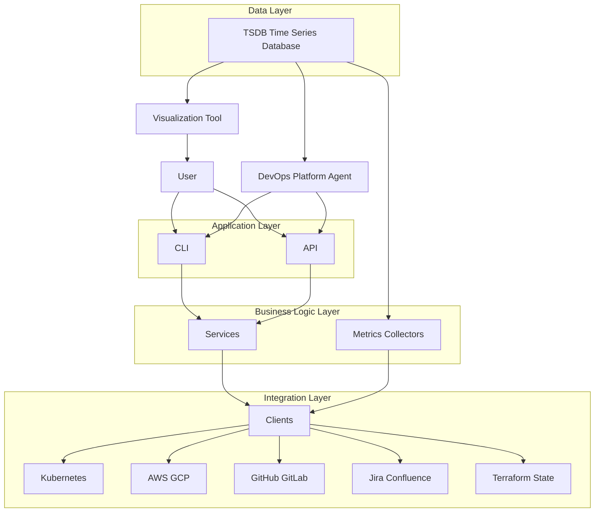

# HAPE Framework

## Table of Contents
- [HAPE Solutions](#hape-solutions)
- [Intellectual Property / Permissions](#intellectual-property--permissions)
- [Contributions](#contributions)
- [Demos](#demos)
- [Architecture](#architecture)
- [Makefile](#makefile)
- [Documentation](#documentation)
- [API](#api)
- [Getting started](#getting-started)
- [Author](#author)

## HAPE Solutions
- [HAPE Solutions](https://hapesolutions.com) is the official website for the HAPE company and product ecosystem.
- [HAPE Vibes](https://vibes.hapesolutions.com) is the product for end-to-end service creation and deployment with integrated logging, monitoring, testing, planning, and architecture diagram workflows to help software architects and engineering teams deliver reliably and fast.

## Intellectual Property / Permissions
Copyright (c) 2026 Hazem Ataya. All rights reserved.

This repository is **not licensed**. No permission is granted to use, copy, modify, merge, publish, distribute, sublicense, or sell any part of this repository or its contents without **explicit written permission** from the copyright holder.

## Contributions
Contributions are not accepted at the moment.

## Demos
- [Demos Directory](demos/README.md)

### DORA GitHub Project Dashboard


### EKS Deployment Cost Dashboard


## Architecture
- [Architecture Document](docs/architecture.md)



## Makefile
- [Makefile Documentation](docs/makefile.md) - reference for Makefile variables, targets, and common workflows.

To list all available Make commands and their descriptions:

```bash
make help
```

## Documentation
- [Documentation Directory](docs/README.md)

## API
- [API Documentation](docs/api/README.md)

## Docker
HAPE Framework is available as a Docker image on Docker Hub:
- [hazemataya/hape](https://hub.docker.com/r/hazemataya/hape)


## Getting started

Install HAPE with pip:

```bash
python3 -m pip install hape
```

Show available commands:

```bash
hape --help
```

Run FastAPI interface:

```bash
make run-api
```

HAPE supports both CLI and API workflows.
API endpoints mirror CLI commands with strict 1:1 naming parity.
Example: `hape github init-repo` maps to `POST /github/init-repo`.

API endpoints require bearer token auth.
Token management uses admin key-protected endpoints.

Generate API token:

```bash
curl -s -X POST "http://localhost:8080/auth/tokens" \
  -H "Content-Type: application/json" \
  -H "X-Hape-Admin-Key: <YOUR_ADMIN_KEY>" \
  -d '{"name":"automation-bot"}'
```

Use API token:

```bash
curl -s -X POST "http://localhost:8080/github/init-repo" \
  -H "Authorization: Bearer <API_TOKEN>" \
  -H "Content-Type: application/json" \
  -d '{"repo_path":"/path/to/repo","owner":"hape-vibes"}'
```

See `docs/api/auth-and-tokens.md` for token lifecycle and security guidance.

Expected output:

```text
usage: hape [-h] [command] ...

CLI for platform and DevOps automations.

commands:
    config                      config file operations.
    gitlab                      GitLab operations.
    github                      GitHub operations.
    jira                        fetch Jira issue data, remote links, or add comments.
    confluence                  confluence page operations.
    csv                         csv conversion operations.
    dora                        DORA metrics operations.
    eks-deployment-cost         generate EKS Deployment/StatefulSet cost report.
    kube-agent                  investigate Kubernetes incidents from CLI triggers.
    init-cicd                   scaffold deployment and CI files for supported projects.
    markdown                    markdown table import/export operations.

options:
  -h, --help                    show this help message and exit
  --version                     print the installed hape version and exit.
  --config-file-path CONFIG_FILE_PATH
                                path to config.json (default: ~/.hape/config.json).
```

## Author
- LinkedIn: https://www.linkedin.com/in/hazem-ataya-29849b151/
- GitHub: https://github.com/hazemataya94
