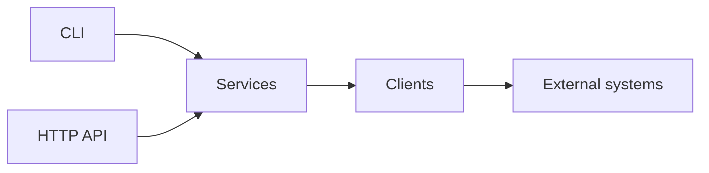

# HAPE Framework

A Python CLI and FastAPI toolkit for platform and DevOps automation.

Same commands, safety levels, and approval rules for engineers and AI coding agents.

[Get started](docs/README.md)

[View demos](docs/guides/README.md)

## How it compares

HAPE complements CI and IaC.

It does not replace Terraform or Kubernetes.

✅ Yes  ❌ No  ◐ Partial

| Approach | Named repeatable CLI | Safety level before run | Approval for write or delete | Shared human and AI rules | Secret redaction |
| --- | --- | --- | --- | --- | --- |
| Ad-hoc scripts plus kubectl | ❌ | ❌ | ❌ | ❌ | ◐ |
| GitHub Actions or GitLab CI | ◐ | ❌ | ◐ | ❌ | ◐ |
| Terraform | ✅ | ◐ | ◐ | ❌ | ◐ |
| Unrestricted AI agent in an IDE | ❌ | ❌ | ❌ | ❌ | ❌ |
| HAPE Framework | ✅ | ✅ | ✅ | ✅ | ✅ |

Read the [Comparison notes](docs/concepts/how-hape-compares.md).

## Benefits for engineers

- Repeatable commands: keep automation in auditable CLI and API paths instead of one-off scripts.
- Readable safety: see read, write, or delete before a command runs.
- Shared rules: humans and AI coding agents follow the same approval workflow.
- Redacted secrets: sensitive values stay hidden unless you pass `--reveal-secrets`.

## First useful output

Two read commands produce reports you can inspect.

- [Kubernetes investigation: findings for a pod.](docs/getting-started/first-useful-output.md#kubernetes-investigation)
- [EKS cost: Deployment and StatefulSet cost report.](docs/getting-started/first-useful-output.md#eks-cost-report)

## AI-assisted automation

Agents can propose a `hape` command.

You still see the safety level, the side effects, and whether approval is required.

- Same surface: CLI and HTTP API stay aligned for most commands.
- Agent rules: repository LLM rules classify tools, redact secrets, and stop for approval.
- Explicit gates: write, delete, remote, publish, apply, and rollout need a yes.

Add those rules from the [AI IDE integration](docs/ai-ide/README.md) guide.

## What it automates

- [Repositories: inspect or bootstrap GitHub and GitLab projects.](docs/guides/repository-automation.md)
- [DORA metrics: compute delivery metrics and run exporters.](docs/guides/dora-workflows.md)
- [Kubernetes: investigate incidents with explicit read commands.](docs/guides/kubernetes-investigation.md)
- [EKS cost: report Deployment and StatefulSet cost.](docs/guides/cost-reporting.md)

## How it works

CLI and API call the same services, then clients, then the external systems.


```mermaid
flowchart LR
  cli[CLI]
  api[HTTP API]
  services[Services]
  clients[Clients]
  systems[External systems]
  cli --> services
  api --> services
  services --> clients
  clients --> systems
```

Read the [CLI, API, service, and client model](docs/concepts/cli-api-service-client.md) for layer ownership.

## Safety and trust

Classify a command before you run it.

- Read: fetch, list, describe, or show only.
- Write: create or update.
- Delete: destructive actions such as delete, purge, rotate, apply, or rollout.

Start with [Command safety](docs/getting-started/safety-basics.md).

## Get started

Install the CLI, then run a read command.

1. [Install HAPE](docs/getting-started/installation.md)
2. [Five-minute quick start](docs/getting-started/five-minute-quickstart.md)
3. [First useful output](docs/getting-started/first-useful-output.md)
4. [Configure one integration](docs/getting-started/configuration.md)
5. [Understand command safety](docs/getting-started/safety-basics.md)
6. [Add HAPE rules to your AI IDE](docs/ai-ide/README.md)

```bash
python -m pip install hape
hape --version
hape --help
```

```bash
hape config show
```

`hape config show` is a `read` command with no side effects.

## Demos

Runnable examples live with the source and in the documentation portal.

- [Guides](docs/guides/README.md)
- [Demos on GitHub](https://github.com/hazemataya94/hape-framework/tree/main/demos)

## Open source

HAPE Framework is licensed under the MIT License.

- [Source repository](https://github.com/hazemataya94/hape-framework)
- [MIT License](LICENSE)
- [Contributing](CONTRIBUTING.md)
- [Security](SECURITY.md)

## License

MIT License.

Copyright (c) 2026 Hazem Ataya.

See [LICENSE](LICENSE).

## Contributions

Public pull requests are accepted.

Every pull request requires personal review and explicit approval from Hazem Ataya.

See [CONTRIBUTING.md](CONTRIBUTING.md).

## Security

Report vulnerabilities privately to `hazem.ataya@hapesolutions.com`.

See [SECURITY.md](SECURITY.md).

## HAPE Solutions

- [HAPE Solutions](https://hapesolutions.com) is the company website.
- [HAPE Vibes](https://vibes.hapesolutions.com) is a separate product for service creation and deployment workflows.

## Docker

A container image is published on Docker Hub as [hazemataya/hape](https://hub.docker.com/r/hazemataya/hape).

## Author

- LinkedIn: https://www.linkedin.com/in/hazem-ataya-29849b151/
- GitHub: https://github.com/hazemataya94
