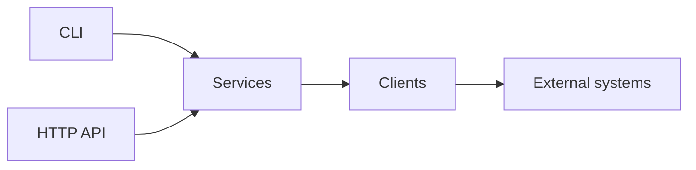

# HAPE Framework

HAPE Framework is a Python CLI and FastAPI toolkit for platform and DevOps automation.

Use it to run explicit, auditable commands against systems such as GitHub, GitLab, Kubernetes, Vault, AWS ECR, Jira, and Confluence.

An AI coding agent can generate a script in seconds.

The hard part is making that automation safe, understandable, and trustworthy six months later.

HAPE gives engineers and AI assistants the same commands, the same safety levels, and the same human-approval rules.

It is for platform engineers, DevOps engineers, and teams that want AI-assisted automation without opaque scripts.

[Get started](docs/getting-started/five-minute-quickstart.md)

[View on GitHub](https://github.com/hazemataya94/hape-framework)

## Benefits for engineers

- Repeatable commands instead of one-off scripts that only one person understands.
- Safety levels you can read before a command runs.
- Auditable CLI and API surfaces that keep the same paths for most operations.
- Shared rules so humans and AI coding agents follow the same workflow.

## AI-assisted automation

HAPE is built for engineers who use AI coding agents in tools such as Cursor, Codex, and Claude Code.

The agent can propose a `hape` command.

You still see the safety level, the side effects, and whether the operation needs approval.

- The CLI and HTTP API expose the same automation surface for most commands.
- Repository LLM rules tell the agent how to classify tools, redact secrets, and stop for human approval.
- Write, delete, remote, publish, apply, and rollout operations require explicit approval.

Add those rules from the [AI IDE integration](docs/ai-ide/README.md) guide.

## What it automates

- Repository bootstrap and GitHub or GitLab operations.
- DORA metric computation and exporter workflows.
- Kubernetes incident investigation.
- EKS deployment cost reporting.
- Vault AppRole login and KV field retrieval.
- Jira, Confluence, CSV, and Markdown conversions.
- FastAPI endpoints with 1:1 CLI path parity for most commands.

## How it works

Every command enters through the CLI or the HTTP API.

Both paths call the same services.

Services talk to system clients.

Those clients reach GitHub, GitLab, Kubernetes, Vault, AWS ECR, Jira, and Confluence.


```mermaid
flowchart LR
  cli[CLI]
  api[HTTP API]
  services[Services]
  clients[Clients]
  systems[External systems]
  cli --> services
  api --> services
  services --> clients
  clients --> systems
```

Read the [CLI, API, service, and client model](docs/concepts/cli-api-service-client.md) for layer ownership.

## Safety and trust

Classify a command before you run it.

- `read` fetches, lists, describes, or shows only.
- `write` creates or updates.
- `delete` covers destructive actions such as delete, purge, rotate, apply, or rollout.
- Side effects are documented on the command, not hidden in a wrapper script.
- Remote, write, delete, publish, apply, and rollout operations require explicit approval.
- Sensitive values stay redacted unless you pass `--reveal-secrets`.

Start with [command safety](docs/getting-started/safety-basics.md).

## Get started

Public technical documentation: [https://framework.hapesolutions.com](https://framework.hapesolutions.com)

1. [Install HAPE](docs/getting-started/installation.md)
2. [Five-minute quick start](docs/getting-started/five-minute-quickstart.md)
3. [Configure one integration](docs/getting-started/configuration.md)
4. [Understand command safety](docs/getting-started/safety-basics.md)
5. [Add HAPE rules to your AI IDE](docs/ai-ide/README.md)

```bash
python -m pip install hape
hape --version
hape --help
```

```bash
hape config show
```

The first command prints the installed version and the command list.

`hape config show` is a `read` command with no side effects.

Sensitive values stay redacted unless you pass `--reveal-secrets`.

## Demos

Runnable examples live with the source and in the documentation portal.

- [Demos documentation](docs/operations/demos.md)

## Open source

HAPE Framework is licensed under the MIT License.

The source, contribution policy, and security reporting path are public.

- [Source repository](https://github.com/hazemataya94/hape-framework)
- [MIT License](LICENSE)
- [Contributing](CONTRIBUTING.md)
- [Security](SECURITY.md)

## License

MIT License.

Copyright (c) 2026 Hazem Ataya.

See [LICENSE](LICENSE).

## Contributions

Public pull requests are accepted.

Every pull request requires personal review and explicit approval from Hazem Ataya.

See [CONTRIBUTING.md](CONTRIBUTING.md).

## Security

Report vulnerabilities privately to `hazem.ataya@hapesolutions.com`.

See [SECURITY.md](SECURITY.md).

## HAPE Solutions

- [HAPE Solutions](https://hapesolutions.com) is the company website.
- [HAPE Vibes](https://vibes.hapesolutions.com) is a separate product for service creation and deployment workflows.

## Docker

A container image is published on Docker Hub as [hazemataya/hape](https://hub.docker.com/r/hazemataya/hape).

## Author

- LinkedIn: https://www.linkedin.com/in/hazem-ataya-29849b151/
- GitHub: https://github.com/hazemataya94
