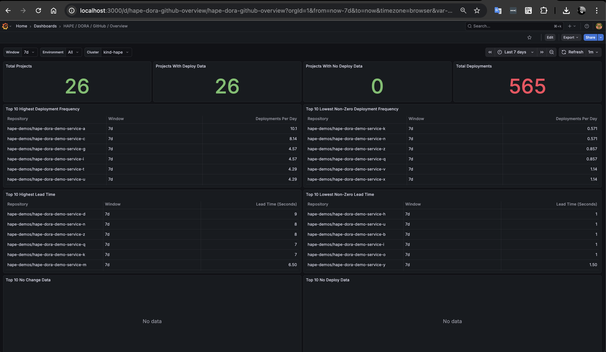
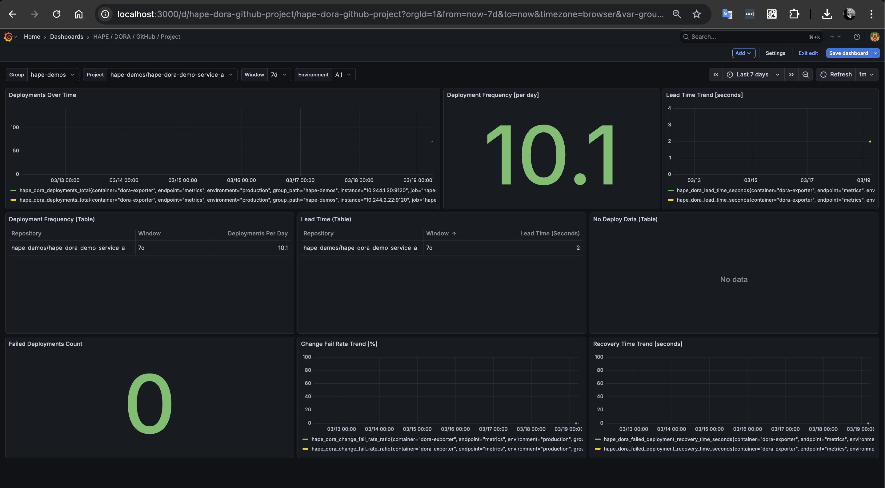

# DORA GitHub Demo

## Purpose
Demonstrate end-to-end DORA output generation for GitHub repositories and show how to visualize the metrics in Grafana.

## Prerequisites
- Python dependencies installed.
- Repository root as current working directory.
- Local Kubernetes toolchain installed (`kind`, `kubectl`, `helm`, `helmfile`, `make`).
- Terraform applied for `infrastructure/terraform/envs/dora-demo-github`.
- GitHub repositories created by that Terraform stack with deploy workflow file.

## Dashboards Screenshots

### HAPE DORA GitHub Overview Dashboard



### HAPE DORA GitHub Project Dashboard



## Create GitHub demo repositories
1. Go to the Terraform environment directory:
```bash
cd infrastructure/terraform/envs/dora-demo-github
```
2. Copy the example variables file:
```bash
cp terraform.tfvars.example terraform.tfvars
```
3. Update `terraform.tfvars` with your GitHub owner, token, and repository values.
4. Initialize, plan, and apply the stack:
```bash
terraform init
terraform plan -out tfplan
terraform apply tfplan
```

## Seed GitHub repositories
Run the seed script for all repositories `hape-dora-demo-service-a` to `hape-dora-demo-service-z`:
```bash
for letter in {a..z}; do
  iterations=$((RANDOM % 16))
  if [ "$iterations" -eq 0 ]; then
    echo "==============================================================="
    echo "==============================================================="
    echo "Skipping hape-dora-demo-service-${letter} (iterations=0)"
    echo "==============================================================="
    echo "==============================================================="
    continue
  fi
  python -m scripts.dora_seed_github \
    --github-token <YOUR_TOKEN> \
    --owner <OWNER> \
    --repo "hape-dora-demo-service-${letter}" \
    --workflow-id deploy.yml \
    --ref main \
    --iterations "$iterations"
done
```

## Deploy seeded demo repositories to `kind-hape`
After seeding, clone and deploy the demo repositories to your local cluster.
By default, the script auto-discovers repositories under `<OWNER>` with prefix `hape-dora-demo-service-`:
```bash
python -m scripts.dora_clone_deploy_github --owner <OWNER> --github-token <YOUR_TOKEN> --clone-protocol https --kube-context kind-hape --manifest-path kubernetes
```
If SSH keys are configured for GitHub, you can use:
```bash
python -m scripts.dora_clone_deploy_github --owner <OWNER> --clone-protocol ssh --kube-context kind-hape --manifest-path kubernetes
```
To override auto-discovery, pass `--repos repo-a,repo-b` or change prefix with `--repo-prefix`.

## Configure GitHub DORA exporter inputs
1. Set GitHub values in repository `.env` (the exporter mounts this file at runtime):
   - PAT mode: `HAPE_GITHUB_TOKEN=<YOUR_TOKEN>`
   - GitHub App mode:
     - `HAPE_GITHUB_APP_ID=<APP_ID>`
     - `HAPE_GITHUB_INSTALLATION_ID=<INSTALLATION_ID>`
     - leave `HAPE_GITHUB_TOKEN` empty
   - `HAPE_DORA_PROVIDER=github`
   - `HAPE_DORA_GITHUB_ORGS=<OWNER>`
2. Set exporter runtime values in `infrastructure/kubernetes/exporters/dora/deployment.yaml`:
   - `HAPE_DORA_PROVIDER=github`
   - `HAPE_GITHUB_APP_PRIVATE_KEY_PATH=/workspace/secrets/github-app.private-key.pem`
   - `HAPE_DORA_GIT_RULES_PATH=/workspace/src/config/dora/git-rules-github.json`
   - `HAPE_DORA_KUBERNETES_MAPPINGS_PATH=/workspace/src/config/dora/kubernetes-mappings-github.json`
   - `HAPE_DORA_PROMETHEUS_URL=http://kube-prometheus-stack-prometheus.monitoring.svc:9090`
3. Put your local GitHub App PEM at `infrastructure/kubernetes/exporters/dora/secrets/github-app.private-key.pem`
   - This file is consumed by `secretGenerator` in `infrastructure/kubernetes/exporters/dora/kustomization.yaml`.
   - Kustomize creates secret `hape-dora-exporter-github-app` automatically during apply.
4. Make sure `config/dora/git-rules-github.json` project paths match your real repositories.

## Deploy exporter and monitoring stack
1. Start local cluster and monitoring:
```bash
make kind-up
make helmfile-sync
```
2. Deploy the exporter with runtime source mounting (no local image build):
```bash
make kustomize-apply infrastructure/kubernetes/exporters/dora
```
3. Verify exporter endpoints:
```bash
kubectl -n monitoring port-forward svc/hape-dora-exporter 9120:9120
curl -s http://localhost:9120/healthz
curl -s http://localhost:9120/metrics-catalog
curl -s http://localhost:9120/metrics
```

> **Note:** `curl -s http://localhost:9120/metrics` can take up to 10 minutes on first refresh.
> Demo refresh interval is set to 1500 seconds (25 minutes) to reduce API load.
> Track progress with exporter logs in namespace `monitoring`, for example:
> `kubectl -n monitoring logs deployment/hape-dora-exporter -f`

## Import dashboards and view real visualization
1. Port-forward Grafana service:
```bash
kubectl -n monitoring port-forward svc/kube-prometheus-stack-grafana 3000:80
```
2. Open Grafana in your browser: `http://localhost:3000`.
3. Import dashboard JSON files:
   - `dashboards/hape-dora-github-overview.json`
   - `dashboards/hape-dora-github-group.json`
   - `dashboards/hape-dora-github-project.json`
4. Set datasource to your Prometheus datasource.
5. Select group/project variables for repositories in your `dora-demo-github` Terraform stack.

## Verification checks
- Exporter `/metrics` exposes `hape_dora_*` series with `provider="github"`.
- Overview dashboard shows deploy and no-deploy tables.
- Group and Project dashboards show seeded repositories.

## Cleanup
```bash
make kustomize-delete infrastructure/kubernetes/exporters/dora
make kind-down
```
