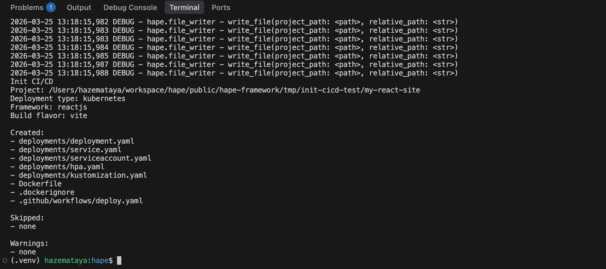

# Init CI/CD Demo

## Purpose
Show how `hape init-cicd` scaffolds Kubernetes manifests and CI files for a React project with local kind-backed functional validation artifacts.

## Prerequisites
- Run commands from repository root: `public/hape-framework`.
- Python dependencies are installed.
- `kind` and `kubectl` are installed.
- `hape` CLI is available in your shell.

## Screenshots



## Create a local working react project

```bash
# current directory: /path/to/hape-framework
rm -rf tmp/init-cicd-test/my-react-site || true
mkdir -p tmp/init-cicd-test/my-react-site

# Access the docker container
docker run --rm -it \
  -v "$PWD"/tmp/init-cicd-test/my-react-site:/app \
  -w /app \
  -p 5173:5173 \
  -p 4173:4173 \
  node:24-alpine sh

# Inside the docker container
npm create vite@9.0.3 . --yes -- --template react --no-interactive
npm install
npm run dev -- --host 0.0.0.0

# Open in browser to verify: http://localhost:5173

npm run build
npm run preview -- --host 0.0.0.0

# Open in browser to verify: http://localhost:4173

# Exit docker container
exit
```

## Run hape init-cicd

```bash
hape init-cicd --project-path tmp/init-cicd-test/my-react-site --deployment-type kubernetes
```


## Infrastructure startup
```bash
make kind-up
```

## Docker image build

```bash
docker build -t my-react-app:dev tmp/init-cicd-test/my-react-site
```

## Docker image load to kind
```bash
kind load docker-image --name hape my-react-app:dev
```

## Replace docker image in the generated kubernetes manifest deployment.yaml
```bash
perl -0pi -e 's|docker\.io/CHANGE_ME/app:latest|my-react-app:dev|' tmp/init-cicd-test/my-react-site/deployments/deployment.yaml
```

## Deploy the react app
```bash
make kustomize-apply tmp/init-cicd-test/my-react-site/deployments 
```

## Port-forward
```bash
kubectl port-forward svc/app 8080:80
```

## Test on browser
- Open http://localhost:8080 in browser
- React "Get Started" page will show meaning the app has been deployed successfully

## Cleanup
Remove local demo project:

```bash
rm -rf tmp/init-cicd
```

Delete kind cluster if you no longer need it:

```bash
make kind-down
```

## Related documentation
- [Init CI/CD user guide](../../docs/user/init-cicd.md)
- [Init CI/CD service logic](../../docs/ops/init-cicd-service.md)
- [Configuration](../../docs/user/config.md)
- [Local Kubernetes](../../docs/infra/local-kubernetes.md)
