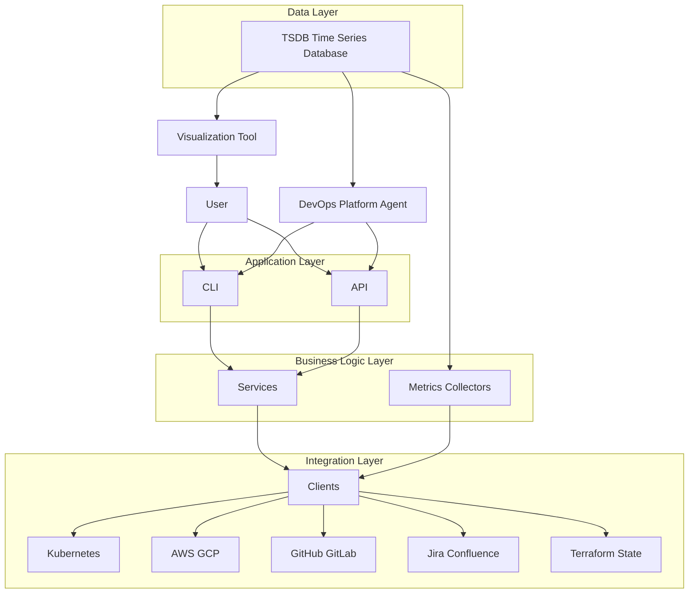
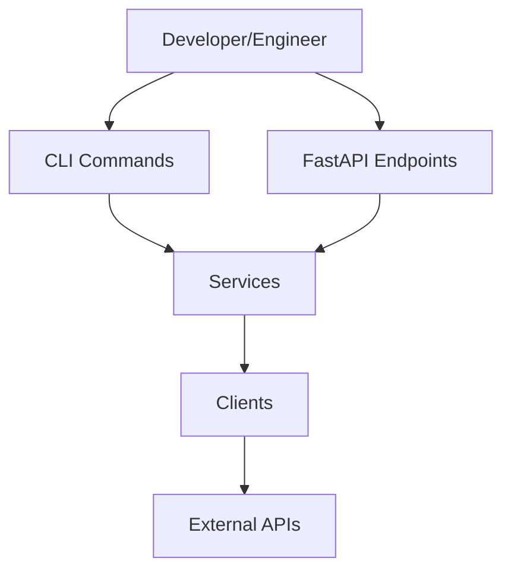
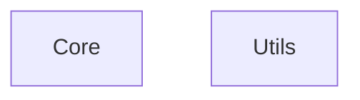

# Architecture

Date: 22.02.2026

## Scope
This document describes the high-level architecture for a self-governance DevOps platform with:
- **Automation** (actions/control)
- **Observation** (metrics/visibility)
- **DevOps Platform Agent** (optional orchestrator; TBD)

3rd-party integrations include (examples): Kubernetes, AWS/GCP, Jira/Confluence, GitHub/GitLab, Terraform state.

---

## Flow chart

---

## Main flows
1) **Observability**
- Metrics collectors read via clients package adapters (cached + rate-limited) → time-series metrics database scrapes metrics collectors → visualization tool dashboards/alerts

2) **Automation**
- User/Agent → CLI or API → services → Python clients → 3rd-party systems (actions/control)

3) **Feedback loop**
- Visualization tool alerts/insights → User/Agent → CLI runs remediation workflows

---

## Automation Platform

### Components
- **Python Clients Package**
  - Connectors that can **control** and **scrape** 3rd-party systems (actions + reads as needed).
- **CLI**
  - Primary interface for **human** and **AI** interaction.
  - Runs automation workflows and exposes a stable command surface.
- **API (FastAPI)**
  - Token-authenticated HTTP interface for the same workflows exposed by CLI.
  - Uses strict 1:1 command parity naming with CLI paths.

### Responsibilities
- Execute operational actions (e.g., remediation, housekeeping, rollout steps).
- Provide a single, auditable execution path (CLI as the choke point).

### Architecture

#### General Layer Model
- **Application Layer**: `CLI` and `API`.
- **Business Logic Layer**: `Services` and `Metrics Collectors`.
- **Integration Layer**: `Clients` and third-party systems (Kubernetes, cloud providers, VCS, work-management tools, Terraform state).
- **Data Layer**: Time-series data store (`TSDB`).
- **Outside layered runtime model**: `User`, `DevOps Platform Agent`, and `Visualization Tool` are interaction actors/surfaces, not core execution layers.

#### Layers
- **CLI**: Argument parsing and user input handling. Commands call services only.
- **API**: HTTP request parsing and response mapping. Endpoints call services only.
- **Services**: Domain logic that orchestrates one or more clients to perform automation tasks.
- **Clients**: Low-level adapters for external systems (Jira, Confluence, GitLab, AWS, Kubernetes).
- **Core**: Cross-cutting infrastructure (configuration, logging, centralized error handling). Shared across all layers.
- **Utils**: Shared utilities that are not domain-specific (file management, helpers). Shared across all layers.
  - Formatters live under `utils/formatters/` and are split by target system.

#### Layer Restrictions
- CLI must not call clients directly. All external access goes through services.
- API must not call clients directly. All external access goes through services.
- Services may call multiple clients, but clients must not call services.
- Clients must not call other clients.
- Core and utils are reusable by any layer, but should not depend on services or CLI.
- Clients should not import CLI or service code.
- API authentication is required via bearer tokens stored in a local JSON token store.
- API throttling is enforced per token (`10` requests per minute).
- Development-only dependencies must live in `requirements-build.txt` and be installed in the `.venv` explicitly (do not auto-install in Make targets).
- Configuration is loaded from JSON via `core/config.py`. CLI passes `--config-file-path` to set the config path.

#### General Flow

Core and utils are shared across all layers.

#### Directory Layout
- `cli/` → CLI entry and command modules
- `services/` → Domain services (e.g., `changelog_service.py`)
- `clients/` → API clients (e.g., `jira_client.py`, `confluence_client.py`)
- `core/` → Config/logging
- `utils/` → File, shared helpers, formatters
- `infrastructure/` → Local Kubernetes setup (`kind`, Helmfile) and future Terraform assets
- `docs/` → Architecture and future documentation

#### Naming Conventions
- Clients: `*_client.py`
- Services: `*_service.py`
- CLI commands: `*_commands.py`

#### Example Responsibility Split
- CLI: `jira_commands.py` parses `issue_key`
- Service: `jira_service.py` chooses which Jira API method to call
- Client: `jira_client.py` performs HTTP requests and returns JSON

#### Configuration
- Default config path: `~/.idap/config.json`
- Create config from `.env`: `config init-config-file`
- Commands can override path using `--config-file-path`

---

## Observation Platform

### Components
- **Metrics Collectors**
  - Read data from 3rd-party APIs and expose metrics for the time-series metrics database.
  - No persistent database. Use caching and rate limiting to keep scrapes stable.
- **Time-Series Metrics Database**
  - Scrapes metrics collectors on a schedule.
- **Visualization Tool**
  - Visualizes metrics and drives alerts.
- **Selected implementations**
  - Prometheus is chosen as the time-series metrics database.
  - Grafana is chosen as the visualization tool.
  - Prometheus exporters are the chosen metrics collectors.

### Architecture

#### Layers
- **Exporters**: Runtime Python modules that collect metrics using clients package adapters and expose Prometheus metrics.
- **Clients**: Low-level adapters for external systems used by exporters and automation services.
- **Dashboards**: Grafana dashboard definitions (JSON) versioned as code.
- **Manifests**: Deployment artifacts for Prometheus, Grafana, and dashboard provisioning.

#### Layer Restrictions
- Exporters must contain collection and metrics exposition logic only and must not contain dashboard or deployment manifest content.
- Exporters must not call external systems directly; exporter integrations must go through clients package modules.
- Dashboards must contain visualization definitions only and must not contain runtime exporter logic.
- Manifests must reference exporters and dashboards as deployable assets and must not duplicate exporter logic.
- Exporters may use core and utils modules, but should not import CLI command modules.

#### Directory Layout
- `exporters/` -> Service-specific exporters (e.g., `eks_deployment_cost_exporter.py`).
- `dashboards/` -> Grafana dashboard files (e.g., `eks-deployment-cost.json`).
- `manifests/grafana/` -> Grafana deployment and provisioning manifests.
- `manifests/prometheus/` -> Prometheus deployment and scrape configuration manifests.

#### Naming Conventions
- Exporters: `*_exporter.py`
- Dashboard files: `*.json` in kebab-case by domain
- Grafana manifest files: `*.yaml` grouped under `manifests/grafana/`
- Prometheus manifest files: `*.yaml` grouped under `manifests/prometheus/`

---

## DevOps Platform Agent OR Rule Engine AI (TBD)
- Orchestrator that decides *what to do* and *when to do it*.
- Executes actions only via the **CLI**.
