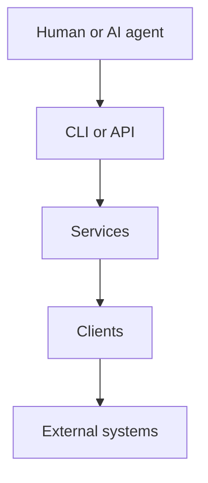

# Execution model

## Purpose

Every user-facing command follows the same runtime path.

## Rules

- CLI modules parse flags and call services only.
- API handlers stay transport-thin and call services only.
- Services own workflow decisions.
- Clients own third-party HTTP or SDK calls.
- Clients must not call other clients.
- Exporters must use client adapters and must not call third-party APIs directly.

## Config

Default config path: `~/.hape/config.json`.

Environment variables and optional `.env` files can supply the same keys.

See [configuration](../getting-started/configuration.md).

## Related documentation

- [CLI, API, services, and clients](cli-api-service-client.md)
- [Architecture](../architecture.md)
- [Architecture rules](../llm/architecture.md)
