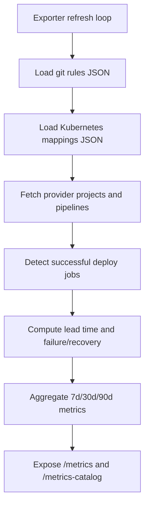

# DORA Exporter

## Purpose
Expose GitLab or GitHub DORA metrics as Prometheus metrics for overview, group, and project dashboards.

## Workflow


## Runtime config
- `HAPE_DORA_EXPORTER_HOST`
- `HAPE_DORA_EXPORTER_PORT`
- `HAPE_DORA_EXPORTER_REFRESH_SECONDS`
- `HAPE_DORA_PROVIDER` (`gitlab` or `github`)
- `HAPE_DORA_GITLAB_GROUP_IDS`
- `HAPE_GITHUB_TOKEN`
- `HAPE_DORA_GITHUB_ORGS`
- `HAPE_GITHUB_API_URL`
- `HAPE_GITHUB_APP_ID`
- `HAPE_GITHUB_INSTALLATION_ID`
- `HAPE_GITHUB_APP_PRIVATE_KEY_PATH`
- `HAPE_DORA_GIT_RULES_PATH`
- `HAPE_DORA_KUBERNETES_MAPPINGS_PATH`
- `HAPE_DORA_PROMETHEUS_URL`

For the `dora-demo-github` Kubernetes deployment, `HAPE_GITHUB_TOKEN` and `HAPE_DORA_GITHUB_ORGS` are read from the mounted repository `.env`.
For the `dora-demo-github` Kubernetes deployment, `HAPE_DORA_EXPORTER_REFRESH_SECONDS` defaults to `1500` seconds.
GitHub API reads in `clients/github_client.py` use in-memory cache with 1 hour TTL and bounded retries for transient `429`/`5xx` responses.
GitHub authentication supports both PAT (`HAPE_GITHUB_TOKEN`) and GitHub App installation token flow (App ID + Installation ID + private key path).
For GitHub App mode in Kubernetes, `infrastructure/kubernetes/exporters/dora/kustomization.yaml` generates secret `hape-dora-exporter-github-app` from `infrastructure/kubernetes/exporters/dora/secrets/github-app.private-key.pem` and mounts it at `/workspace/secrets/github-app.private-key.pem`.

## Endpoints
- `GET /metrics`
- `GET /metrics-catalog`
- `GET /healthz`

## Local run
```bash
python -m exporters.dora_exporter
```

## Validate endpoints
```bash
curl -s http://localhost:9120/metrics-catalog
curl -s http://localhost:9120/healthz
curl -s http://localhost:9120/metrics
```
