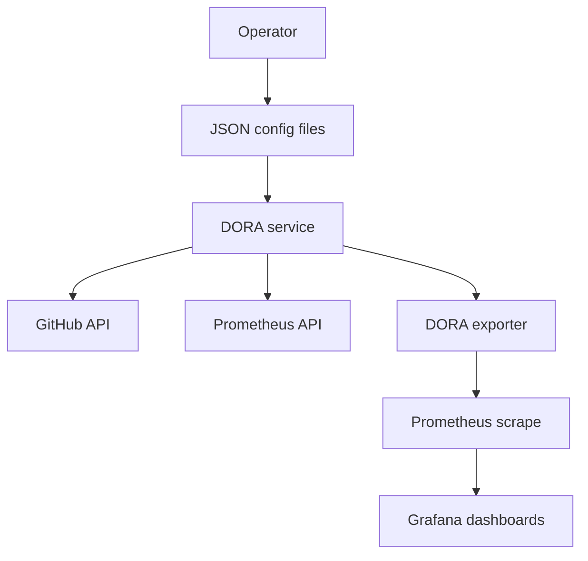

# DORA GitHub Operations

## Purpose
Operate GitHub-based DORA collection with GitHub Actions workflow/job data, commit history, and Prometheus workload signals.

## Scope
- Deployment frequency from successful GitHub Actions deploy jobs.
- Lead time from commit history between successive successful deployments.
- Change fail rate and failed deployment recovery from Prometheus and Kubernetes mapping signals.

## Flow

## Provider settings
- `HAPE_DORA_PROVIDER=github`
- `HAPE_GITHUB_TOKEN=<YOUR_TOKEN>` (PAT mode)
- `HAPE_GITHUB_APP_ID=<APP_ID>` (GitHub App mode)
- `HAPE_GITHUB_INSTALLATION_ID=<INSTALLATION_ID>` (GitHub App mode)
- `HAPE_GITHUB_APP_PRIVATE_KEY_PATH=<PATH_TO_PEM>` (GitHub App mode)
- `HAPE_DORA_GITHUB_ORGS=org-a,org-b`
- `HAPE_GITHUB_API_URL=https://api.github.com`

## Terraform bootstrap
- Use `infrastructure/terraform/modules/github_owner`.
- Use `infrastructure/terraform/modules/github_repository`.
- Use `infrastructure/terraform/modules/github_repository_files`.
- See `docs/infra/terraform-dora-github.md` for module usage.

## Dashboard names
- `HAPE / DORA / GitHub / Overview`
- `HAPE / DORA / GitHub / Group`
- `HAPE / DORA / GitHub / Project`

## Expected data tables
- No deploy data table for configured repositories with zero deploys.
- No change data table for configured repositories with no lead-time change set.
- Lowest non-zero ranking tables for deployment frequency, lead time, change fail rate, and recovery time.

## Related documentation
- [DORA Metrics (User Guide)](../user/dora.md)
- [DORA Exporter Runbook](../exporters/dora-exporter.md)
- [Terraform DORA GitHub](../infra/terraform-dora-github.md)
- [Configuration](../user/config.md)
