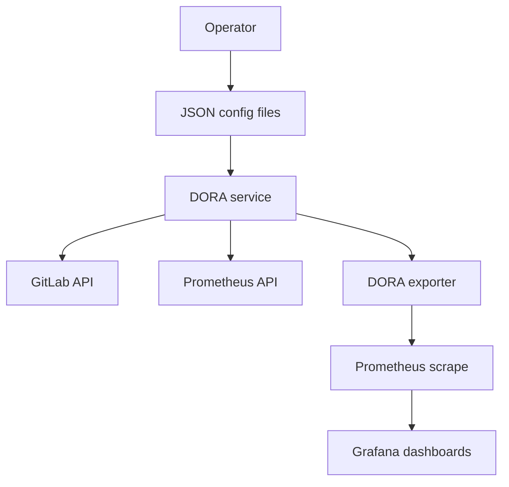

# DORA GitLab Operations

## Purpose
Operate GitLab-based DORA collection without GitLab paid features or deployment records.

## Scope
- Deployment frequency from successful CI deploy jobs.
- Lead time from commit history between successful deployments.
- Change fail rate and failed deployment recovery from Prometheus and Kubernetes mapping signals.

## Flow

## Provider settings
- `HAPE_DORA_PROVIDER=gitlab`
- `HAPE_GITLAB_DOMAIN=gitlab.com`
- `GITLAB_TOKEN=<YOUR_TOKEN>`
- `HAPE_DORA_GITLAB_GROUP_IDS=123,456`

## Terraform bootstrap
- Use `infrastructure/terraform/modules/gitlab_group`.
- Use `infrastructure/terraform/modules/gitlab_project`.
- Use `infrastructure/terraform/modules/gitlab_repository_files`.
- See `docs/infra/terraform-dora-gitlab.md` for environment stack usage.

## Dashboard names
- `HAPE / DORA / GitLab / Overview`
- `HAPE / DORA / GitLab / Group`
- `HAPE / DORA / GitLab / Project`

## Expected data tables
- No deploy data table for configured projects with zero deploys.
- No change data table for configured projects with no lead-time change set.
- Lowest non-zero ranking tables for deployment frequency, lead time, change fail rate, and recovery time.
