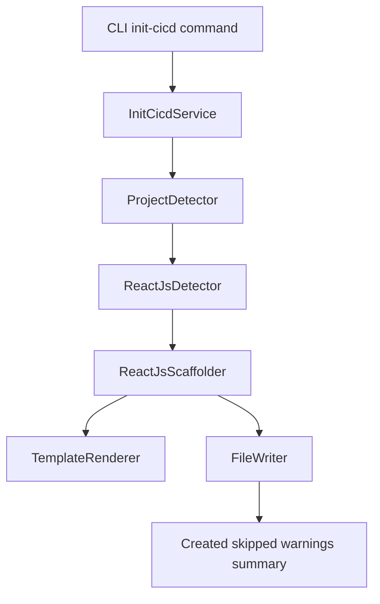

# Init CI/CD Service Logic

## Purpose
Document architecture and operational behavior for the standalone `init-cicd` command and `InitCicdService`.

## Service and module locations
- CLI command: `cli/commands/init_cicd_commands.py`
- Service entrypoint: `services/init_cicd/init_cicd_service.py`
- Detection: `services/init_cicd/detector/`
- Rendering: `services/init_cicd/renderer/`
- File writing: `services/init_cicd/writer/`
- Scaffolding: `services/init_cicd/scaffolders/`
- Templates: `services/init_cicd/templates/reactjs/`

## Runtime flow


## Command contract
- Command path: `hape init-cicd`
- Required flags:
  - `--project-path`
  - `--deployment-type`
- v1 supported deployment type:
  - `kubernetes`

## Behavior summary
- Detects React projects with Vite, CRA, or generic `scripts.build`.
- Creates deployment files in `deployments/` when missing.
- Skips deployment file generation when `deployments/` exists and still creates missing root/workflow files.
- Skips existing files and never overwrites in v1.
- Generates namespace-neutral manifests.
- Deployment manifest includes memory limit and omits CPU under `resources.limits`.
- Workflow builds only and does not push or deploy.

## Error contract
- Validation failures use `HapeValidationError`.
- External or system failures use `HapeExternalError`.
- Errors include code, human message, and minimal non-sensitive context.

## Operational validation
1. Run:
```bash
hape init-cicd --project-path /path/to/react/project --deployment-type kubernetes
```
2. Confirm summary sections exist: `Created`, `Skipped`, `Warnings`.
3. Confirm deployment manifest has no `namespace` and no CPU under `resources.limits`.
4. Confirm workflow has no login, push, or deploy steps.

## Test references
- Unit/integration tests: `tests/init_cicd/`
- Run:
```bash
python -m pytest tests/init_cicd
```
- Opt-in kind-backed functional test:
```bash
HAPE_RUN_KUBE_AGENT_FUNCTIONAL_TESTS=1 python -m pytest tests/init_cicd/test_init_cicd_functional.py -s
```

## Future direction
The command is designed for deployment-type expansion in future versions, including options such as `aws-serversless`.
