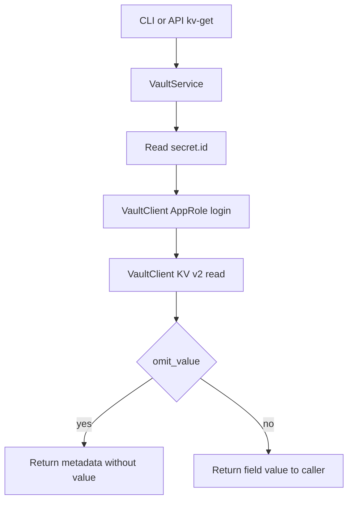

# Vault Service Logic

## Purpose

Document AppRole login and KV field retrieval for `VaultService`.

The service reads `secret_id` from a file, logs in to Vault, and returns one KV v2 field.

It does not upload to PyPI and does not call twine.

## Service and module locations

- CLI command: `cli/commands/vault_commands.py`
- API route: `api/routers/vault_router.py`
- Service entrypoint: `services/vault_service.py`
- HTTP client: `clients/vault_client.py`

## Runtime flow



## Command contract

- Command path: `hape vault kv-get`
- API path: `POST /vault/kv-get`
- Default secret file: `HAPE_WORKSPACE_ROOT/secret.id`
- Default KV path: `kv/example/pypi` field `token`
- CLI default stdout is the field value
- `--omit-value` returns metadata only

## Validation steps

1. Run unit tests:

```bash
python -m pytest tests/vault
```

Expected: tests pass with fake Vault HTTP responses and no live Vault or PyPI calls.

2. Confirm retrieval without printing a secret:

```bash
hape vault kv-get --omit-value
```

## Related documentation

- [Vault CLI](../cli/vault.md)
- [Makefile Docs](../makefile.md)
- [CLI To API Parity Mapping](../api/parity-mapping.md)
